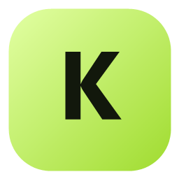
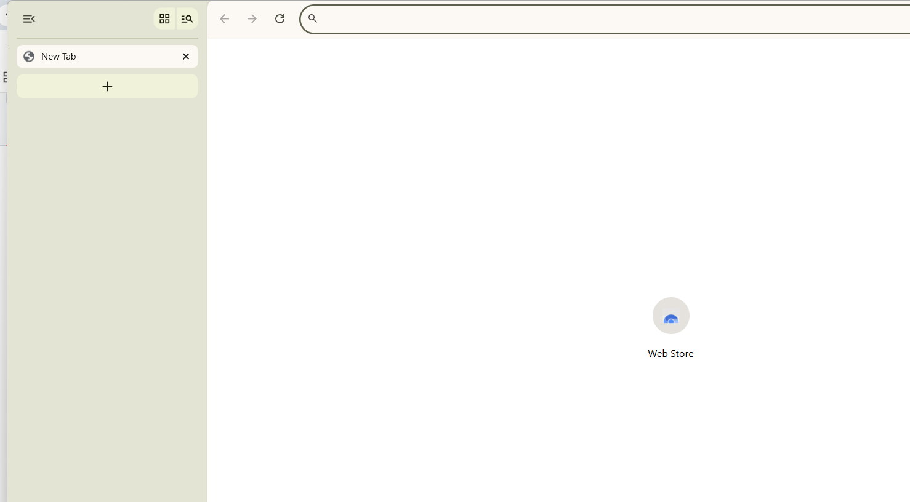

<p align="center">
  
</p>

<h1 align="center">Kwiken</h1>

<p align="center">
  A calm, lightweight Windows browser with native vertical tabs, built on the
  complete Chromium browser engine rather than Electron or an embedded webview.
</p>



## Install

Download `Kwiken-Setup-150.0.7871.186.exe` from the latest GitHub release.
Kwiken installs per-user, creates Start menu and desktop shortcuts, registers
itself with Windows Default Apps, and keeps its profile in
`%LOCALAPPDATA%\Kwiken\User Data`.

The current installer is not code-signed, so Windows SmartScreen may show an
unknown-publisher warning. The release notes include its SHA-256 checksum.

## Browser Features

- Complete Chromium multi-process architecture and sandbox
- Native vertical tabs enabled on first launch
- Local profiles, history, bookmarks, passwords, passkeys, downloads, and DevTools
- Chromium extension support and normal website permissions
- Session restoration and Do Not Track enabled by default
- Kwiken product branding, iconography, and lime/olive color system
- Windows registration for HTTP, HTTPS, HTML, and PDF defaults
- Clean migration from the earlier Electron prototype

## Google Sign-In

Google website sign-in opens in a normal top-level Chromium browser context.
The packaged build loads the Google Accounts sign-in page without Electron's
"browser or app may not be secure" block. Browser-level Chrome Sync is separate
and remains unavailable because Google does not issue private Chrome API
credentials for independent Chromium distributions.

## Reproducibility

The installable distribution uses the matching
`ungoogled-chromium-windows` GitHub Actions build of Chromium
`150.0.7871.186`. Its archive SHA-256 is pinned and verified before packaging.
Kwiken then compiles its native Win32 launcher, rebrands Chromium resource
packs, applies first-run preferences, and creates the NSIS installer.

```powershell
.\chromium-fork\scripts\build-distribution.ps1
```

This fast build requires Python 3, the Visual Studio C++ build tools, and NSIS.
It downloads and checksum-verifies the pinned Chromium runtime automatically;
it does not require a Chromium source checkout.

The full source-fork path is also pinned and reproducible:

```powershell
.\chromium-fork\scripts\bootstrap.ps1
.\chromium-fork\scripts\build.ps1 -Jobs 2
```

When `chromium-fork/VERSION` changes on `master`, GitHub Actions builds the
Windows installer and publishes or refreshes the matching GitHub release.

See [`chromium-fork/README.md`](chromium-fork/README.md) for implementation,
authentication, codec, and build details.
